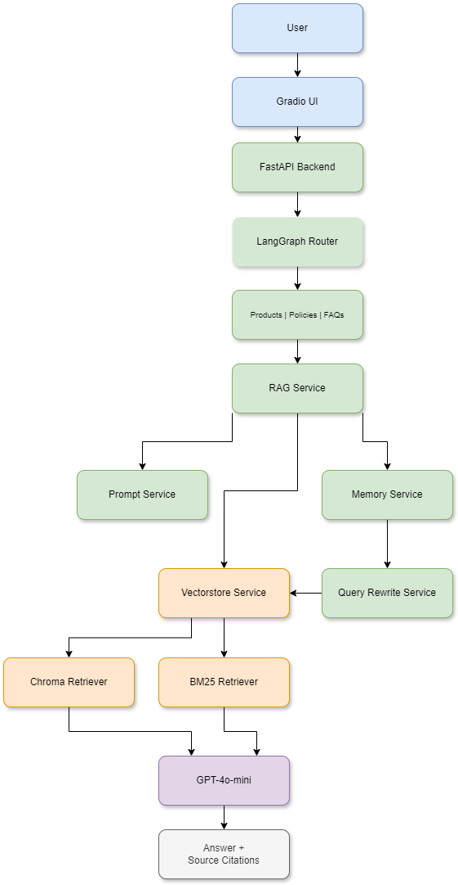
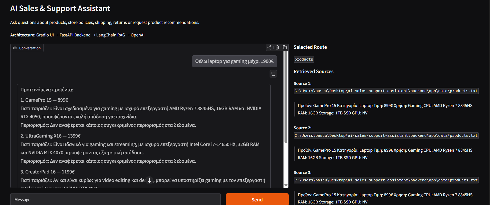
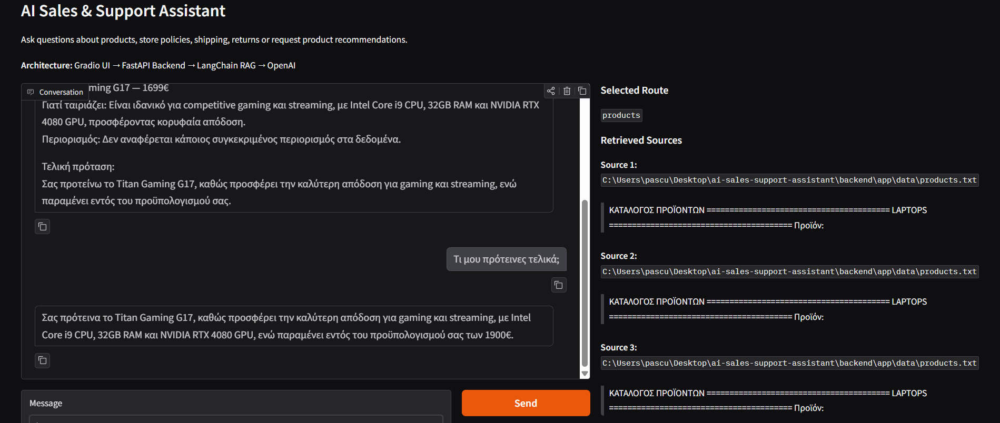
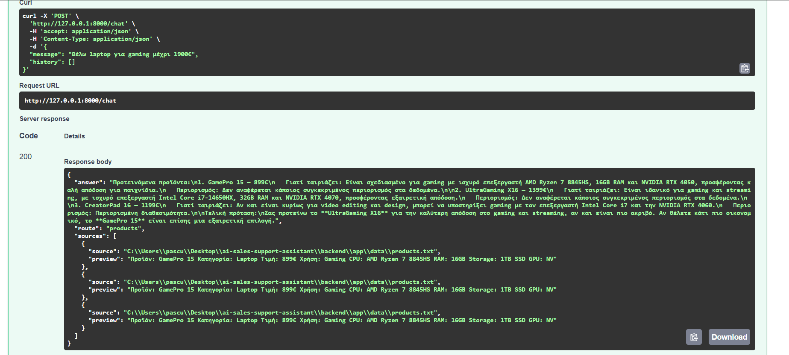
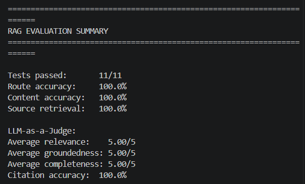

# AI Sales & Support Assistant

AI-powered sales and customer support assistant for a technology store.

The application helps users ask questions about products, store policies, shipping, returns and warranties. It can also recommend products based on budget and use case.

## Features

- FastAPI backend
- Gradio chat UI
- LangChain RAG pipeline
- OpenAI LLM integration
- Chroma vector store
- Hybrid retrieval using Chroma and BM25
- Conversation-aware query rewriting
- Product recommendation support
- Product comparison support
- FAQ, policies and product catalog retrieval
- Conversation memory
- Summary of older chat history
- LangGraph-based routing
- Retrieved source previews
- Source citations in generated answers
- Out-of-scope question handling
- Automated RAG evaluation
- Multi-turn conversation evaluation
- LLM-as-a-Judge evaluation

## AI Sales & Support Assistant Architecture

The architecture combines LangGraph routing, conversation memory, query rewriting, hybrid retrieval (BM25 + Chroma), prompt engineering and GPT-4o-mini to generate grounded responses with source citations.




## Project Structure

The codebase is organized using separation of concerns. Backend logic, frontend UI, documentation, knowledge bases and AI services are kept in separate folders.

```text
ai-sales-support-assistant/
├── backend/
│   └── app/
│       ├── core/
│       │   └── settings.py                 # Application settings and constants
│       ├── data/
│       │   ├── faqs.txt                    # FAQ knowledge base
│       │   ├── policies.txt                # Store policies knowledge base
│       │   └── products.txt                # Product catalog knowledge base
│       ├── routers/
│       │   └── chat.py                     # FastAPI /chat endpoint
│       ├── schemas/
│       │   └── chat_schema.py              # Pydantic request/response schemas
│       ├── services/
│       │   ├── graph_service.py            # LangGraph routing logic
│       │   ├── memory_service.py           # Conversation memory and summarization
│       │   ├── prompt_service.py           # RAG and summary prompts
│       │   ├── query_rewrite_service.py    # Conversation-aware query rewriting
│       │   ├── rag_service.py              # Main RAG workflow
│       │   └── vectorstore_service.py      # Hybrid retrieval with Chroma and BM25
│       ├── vectorstore/                    # Local Chroma vector stores (ignored by Git)
│       └── main.py                         # FastAPI application entry point
│
├── frontend/
│   ├── config.py                           # Frontend API configuration
│   └── gradio_app.py                       # Gradio chat interface
│
├── docs/
│   ├── architecture_diagram.png            # Architecture diagram
│   ├── evaluation_results_screenshot.png   # Automated RAG evaluation results
│   ├── memory_screenshot.png               # Conversation memory example
│   ├── project_report.md                   # Detailed project report
│   ├── swagger_screenshot.png              # FastAPI Swagger screenshot
│   ├── test_cases.md                       # Manual test cases
│   └── ui_screenshot.png                   # Gradio UI screenshot
│
├── evaluation/
│   ├── evaluate_rag.py                     # Automated RAG evaluation runner
│   ├── judge_service.py                    # LLM-as-a-Judge evaluation
│   └── test_cases.py                       # Single-turn and multi-turn test cases
│
├── .gitignore                              # Ignored files and folders
├── LICENSE                                 # Project license
├── README.md                               # Project documentation
└── requirements.txt                        # Python dependencies
```

## Screenshots

### Product Recommendation



### Conversation Memory



### API Documentation



## Installation

Create and activate a virtual environment:
```cmd
py -3.12 -m venv venv
venv\Scripts\activate
```

Install dependencies:
```cmd
pip install -r requirements.txt
```

## Environment Variables

Create a `.env` file in the project root:

```env
OPENAI_API_KEY=your_openai_api_key_here
```

## Run Backend
```cmd
uvicorn backend.app.main:app --reload
```

Open Swagger UI:
```
http://127.0.0.1:8000/docs
```

## Run Frontend

In a second terminal:

```cmd
python frontend/gradio_app.py
```

Open:

```
http://127.0.0.1:7860
```

## Example Questions

### Product Recommendation

```text
Θέλω laptop για gaming μέχρι 900€
Θέλω laptop για gaming μέχρι 1900€
Έχετε monitor για design;
```

### Product Comparison

```text
Σύγκρινε GamePro 15 με NitroPlay 15
Σύγκρινε ProColor 32 με StudioColor 27
```

### Conversation Memory

```text
Τι μου πρότεινες τελικά;
```

### Store Policies & FAQs

```text
Πόσα χρόνια εγγύηση έχουν τα laptops;
Σε πόσες δόσεις μπορώ να πληρώσω;
Υπάρχει τεχνική υποστήριξη;
Υποστηρίζετε Box Now;
```

### Out-of-scope Handling

```text
Ποιος κέρδισε το Champions League;
```

## Evaluation

The project includes an automated evaluation pipeline for testing the RAG system.

Run the evaluation from the project root:

```cmd
python -m evaluation.evaluate_rag
```
**The evaluation includes:**
- Knowledge-base routing accuracy
- Expected answer content checks
- Source retrieval checks
- Source citation validation
- Single-turn test cases
- Multi-turn conversation test cases
- LLM-as-a-Judge evaluation

**The LLM-as-a-Judge evaluates generated answers using three criteria:**
- Relevance
- Groundedness
- Completeness

**Current evaluation results:**

```text
Tests passed:       11/11
Route accuracy:     100.0%
Content accuracy:   100.0%
Source retrieval:   100.0%
Citation accuracy:  100.0%

LLM-as-a-Judge:
Average relevance:    5.00/5
Average groundedness: 5.00/5
Average completeness: 5.00/5
```




Manual test cases are available in:

```text
docs/test_cases.md
```

## GenAI Techniques Used

### Prompt Engineering

The assistant uses structured prompts to answer as a sales and support assistant for a technology store.

### Hybrid Retrieval

The retrieval layer combines Chroma vector similarity search with BM25 keyword-based retrieval. This improves results for both semantic user queries and exact product, payment or policy terms.

Chroma is persisted locally and existing collections are loaded on application startup instead of being re-indexed, preventing duplicate document chunks from being added across multiple runs.

### Product Comparison

The assistant can compare products side-by-side using retrieved catalog data and present the comparison in a structured table.

### Source Transparency

The assistant returns retrieved source previews and can include source citations in generated answers.

### Retrieval-Augmented Generation

The application loads business knowledge from text files, splits it into chunks, creates embeddings and stores them in Chroma. The RAG pipeline uses chunk size 700, overlap 120 and retrieves the top 5 most relevant chunks.

### Conversation Memory

The system keeps recent chat messages and summarizes older messages, allowing follow-up questions.

### Query Rewriting

The system uses conversation-aware query rewriting to improve retrieval for follow-up questions.

When a user asks an ambiguous follow-up question, the current question and conversation context are used to generate a standalone retrieval query. This allows the hybrid retriever to search with the complete intent while preserving the original conversation.

For example:

```text
Previous question:
Θέλω laptop για gaming μέχρι 900€

Follow-up:
Τι μου πρότεινες τελικά;

Rewritten retrieval query:
A standalone query containing the relevant context from the previous conversation.
```

The rewritten query is used only for document retrieval, while the original question and conversation context are preserved for final answer generation.


### LangGraph Routing

LangGraph is used to route user questions to the correct knowledge base:
- products
- policies
- FAQs

## Notes

The application was developed as an educational project for the AI for Developers program.

The project demonstrates the integration of FastAPI, LangChain, LangGraph, Chroma, OpenAI models, hybrid retrieval, query rewriting, conversation memory and automated RAG evaluation in a complete end-to-end AI application.

## License

This project is publicly visible for portfolio, review and educational demonstration purposes only.

You may view and study the source code, but you may not copy, modify, redistribute, republish, submit, or present this work as your own without explicit permission from the author.

© 2026 Alexandros Paschalis Chatzis. All rights reserved.
